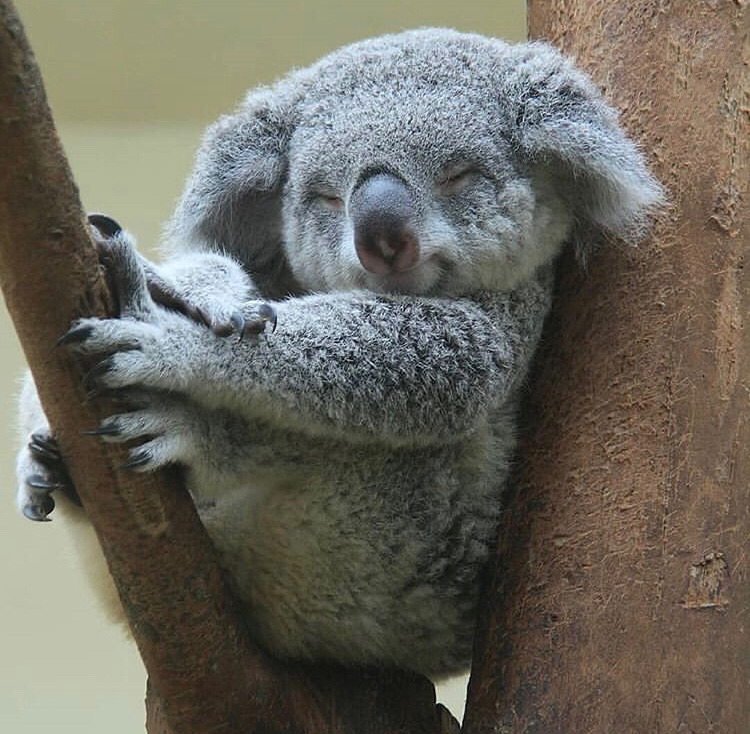

# Hello

My name is Panna.
These are my fav. things:

- diving
- peanut butter

## Why you are taking this class

Because I think it is a very cool things to do, learing coding with girls around the world.

### What your favorite things are (or what you hope to visit) in Barcelona

I really wanted to visit the Picasso Museum!

#### What your professional background is

Graduated from business management and psychology. (but I cannot read peoples' mind!)

##### What your previous experiences with coding are

Studying html and css from codeacademy.

###### Some fun facts about me

 This is normal me. :)
 

###### [My GitHub](https://github.com/pannachow)
